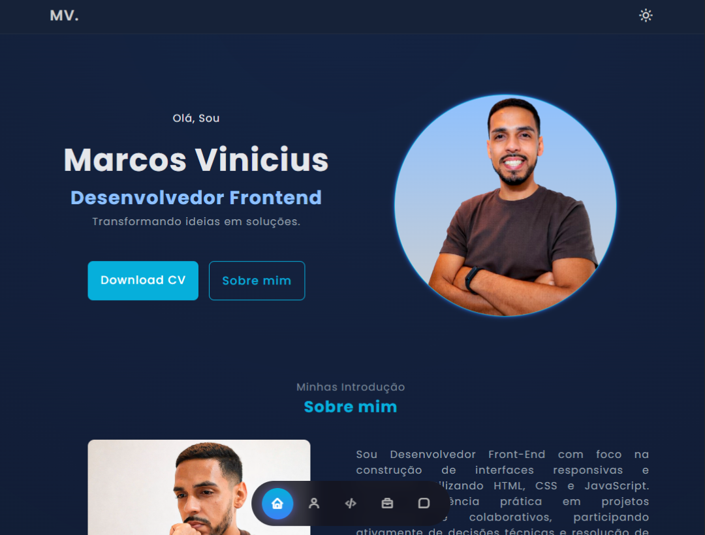

🌐 Acesse meu [Portfólio](https://portfolio-eta-fawn-59.vercel.app/)

# 💼 Portfolio - Marcos Vinicius Oliveira

Este é o meu portfólio pessoal, criado para apresentar meus projetos, habilidades e experiências na área de desenvolvimento web.

## 🚀 Sobre o projeto

O objetivo deste projeto é reunir meus principais trabalhos e demonstrar minhas habilidades em desenvolvimento utilizando tecnologias modernas da web.

O portfólio foi desenvolvido com foco em:

- Interface limpa e moderna
- Responsividade para diferentes dispositivos
- Boas práticas de HTML, CSS e JavaScript
- Performance e organização de código

## 🛠 Tecnologias utilizadas

## ✨ Funcionalidades

- Navegação suave entre seções
- Layout totalmente responsivo
- Seção de projetos com filtro por categoria
- Links para projetos e repositórios no GitHub
- Seção de contato

## 📂 Estrutura do projeto
portfolio/
│
├── assets/
│ ├── css/
│ ├── img/
│ └── js/
│
├── index.html
├── license
├── README.md
├── robot.txt
└── sitemap.xml

## 🌐 Deploy

Você pode acessar o projeto online aqui:

# 💼 Portfolio - [Marcos Vinicius Oliveira](https://portfolio-eta-fawn-59.vercel.app/)

## 📸 Preview

## 📬 Contato

<a href="https://www.linkedin.com/in/mvinicius-developer/" target="_blank">
   LinkedIn
</a>

 

<a href="https://github.com/vinioliveira-developer" target="_blank">
   GitHub
</a>

 

<a href="mailto:mvinicius.developer@gmail.com">
  📧 Email: mvinicius.developer@gmail.com
</a>

---

⭐ Se você gostou do projeto, fique à vontade para dar uma estrela no repositório!
